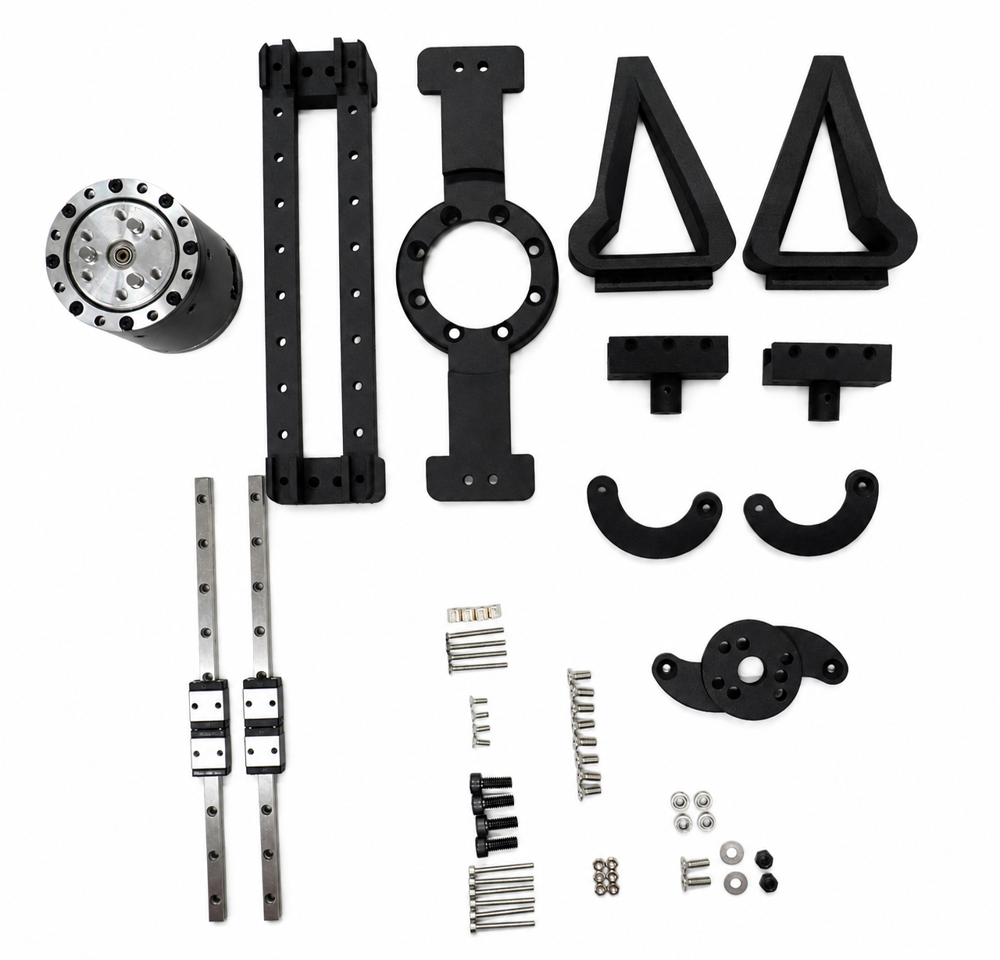
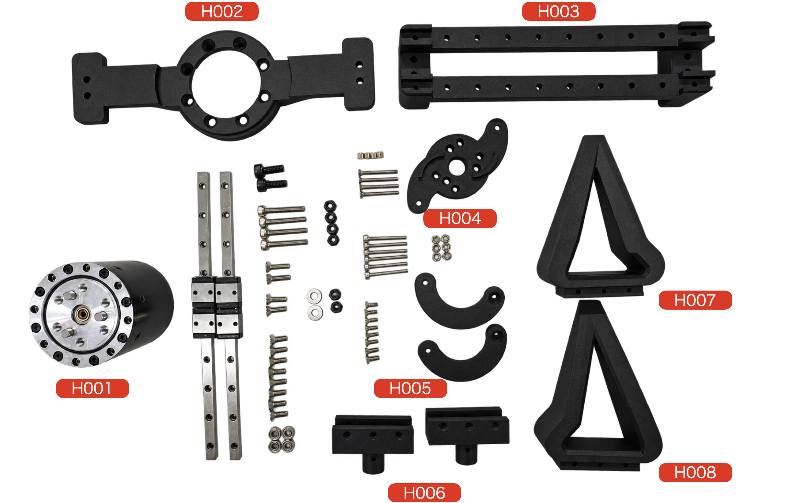
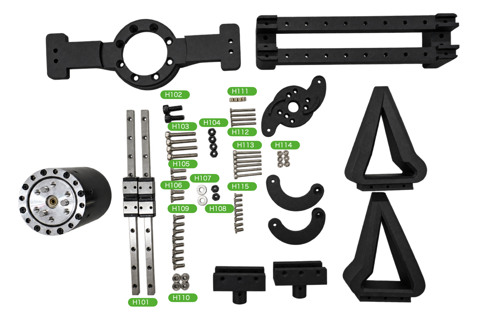

# ハンド

## プレビュー

## 部品一覧

|No|名称|個数|概要|
|:--|:--|:--|:--|
|H001|RS05|1|QDD(左ID 0x01, 右ID 0x11|
|H002|hand_base|1|ハンド固定|
|H003|linear_mount|1|リニアマウント|
|H004|rotor|1|QDDと連結用|
|H005|rotor_arm|2|finger連結用|
|H006|finger_adaptor_left|1|fingerとrotor連結用|
|H006|finger_adaptor_right|1|fingerとrotor連結用|
|H007|finger_left|1|左のfinger|
|H008|finger_right|1|右のfinger|

|No|名称|個数|概要|
|:--|:--|:--|:--|
|H101|Linear|2|Linear|
|H102|M4x100mm|4|Rotorと連結|
|M103|M3x20六角ネジ|4|M3x20mmでLinearとベースを固定|
|M104|M3ナット|6|M3ナット|
|M105|M3x14mm皿ねじ|2|Rotor ARMとの連結|
|M106|M3x10mm皿ねじ|2|m3x10mm|
|M107|M3ワッシャー|2|m3ワッシャー|
|M108|M3ナット|6|M3ナット|
|H109|M3x8mm皿ねじ|8|m3x8mm|
|H110|M6-3ベアリング|4|ルーター用|
|H111|M2六角ナット|4|Linear留め用|
|H112|M2x20mm皿ねじ|4|Linear留め用|
|H113|M2x20mm六角|6|指先留め用|
|H114|M2ナット|6|M2ナット|
|H115|M2x6mm皿ねじ|8|M2x6mm皿ねじ|
