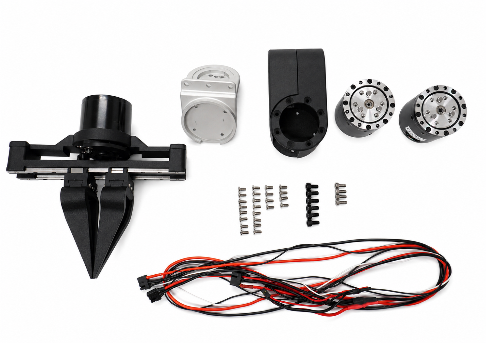
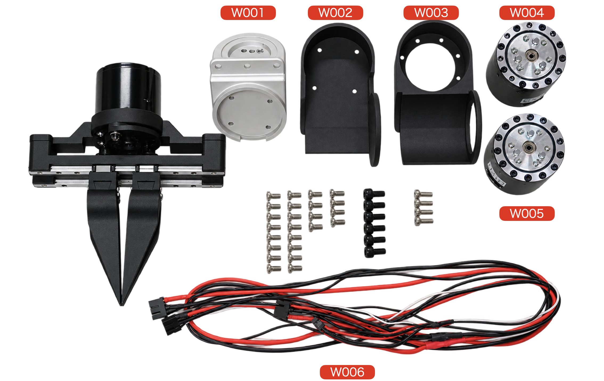
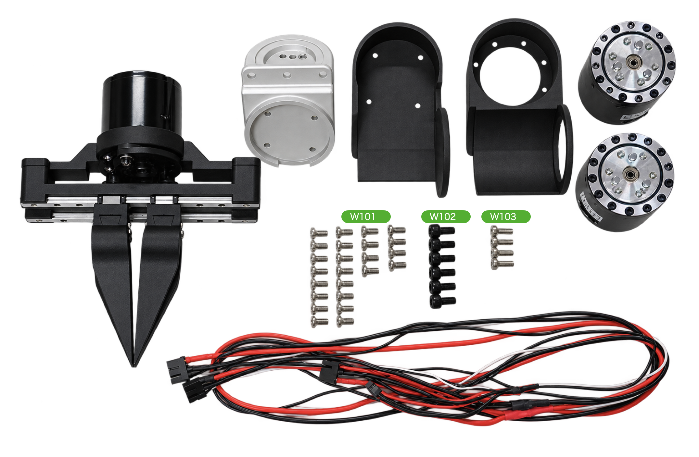

# ハンド

## プレビュー

## 組立済み

|No|名称|個数|概要|
|:--|:--|:--|:--|
|Hand|ハンド|1|組立済みハンド|

## 部品一覧

|No|名称|個数|概要|
|:--|:--|:--|:--|
|W001|hand_joint|1|アルミ|
|W002|left_wrist_base|1|ナイロン3D Printパーツ|
|W003|left_wrist_cover|1|Qナイロン3D Printパーツ|
|W004|RS05|1|QDD(左ID 0x02, 右ID 0x12|
|W005|RS05|1|QDD(左ID 0x02, 右ID 0x12|
|W006|ケーブル|1|手首用ケーブル|

|No|名称|個数|概要|
|:--|:--|:--|:--|
|W101|M3x8mm皿ねじ|24|m3x8mm|
|W102|M4x8mm|6|hand_joint固定|
|W103|M3x8mm六角|4|hand_joint固定|
