# 手首の組立

## 1.ハンドとhand_jointの連結

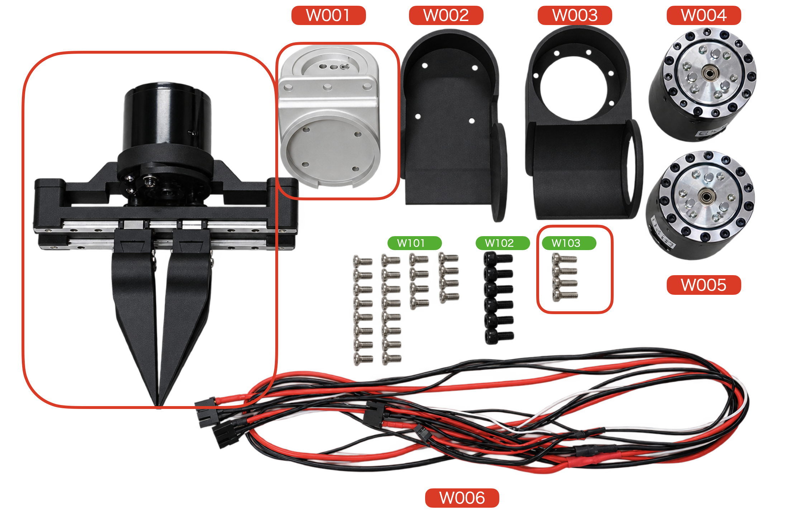

W003(M3x8mm六角ネジ)のネジで固定する。

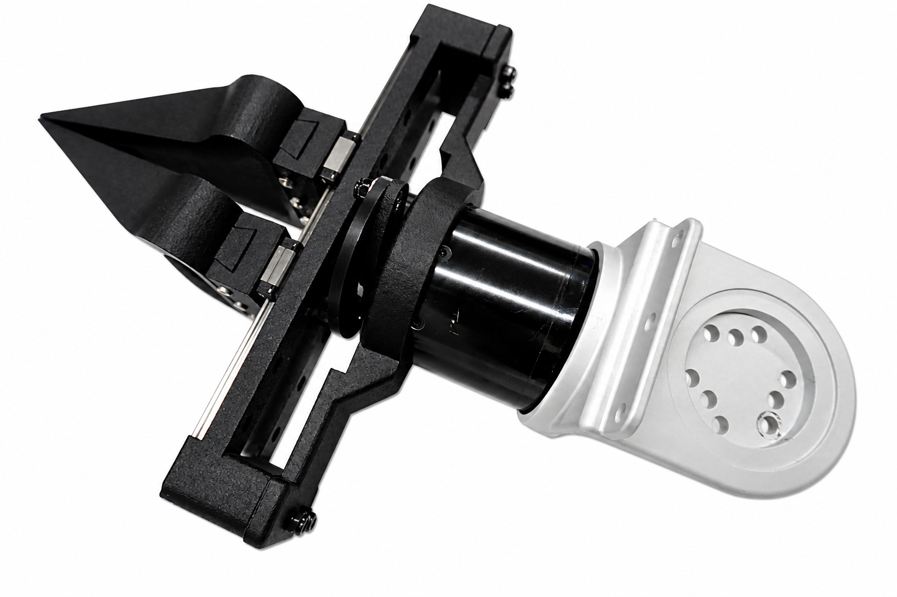

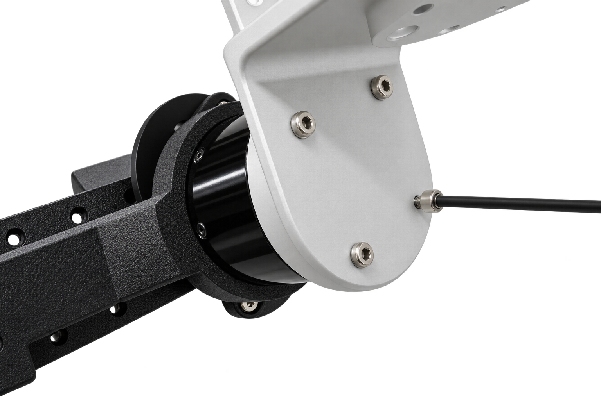

## 2.QDDを装着

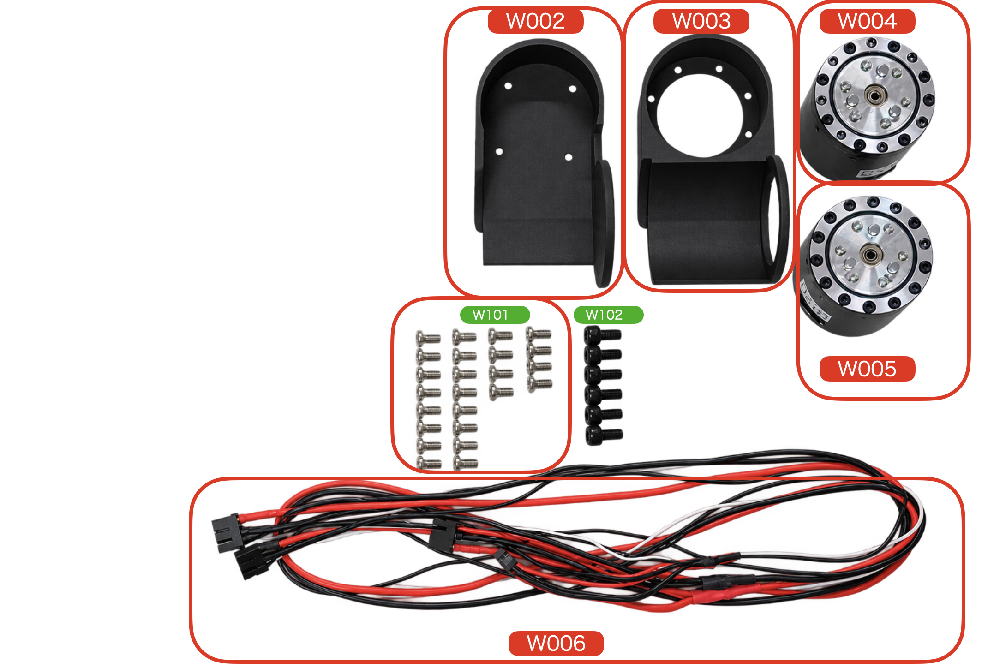

W003に、W004, W005を装着する。さらにW006のケーブルも装着する。一番長いコネクタは、ハンド用なので、2番目と3番目に長いコネクタを0x03, 0x02のQDDに接続する。

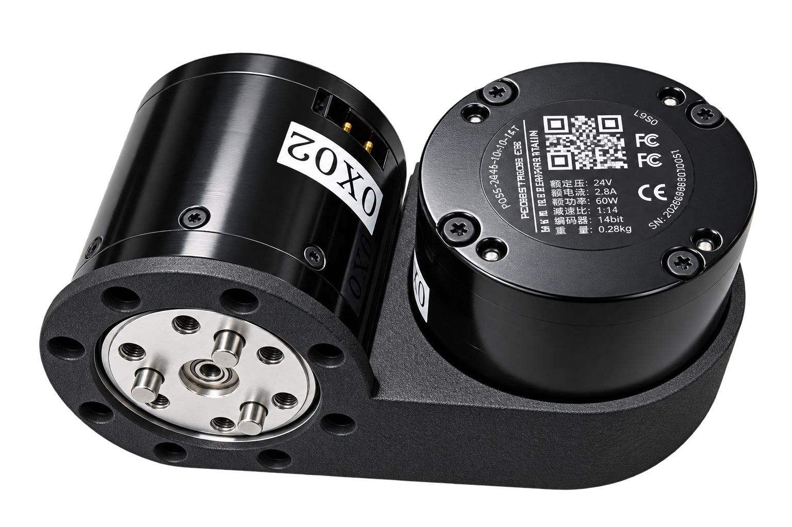

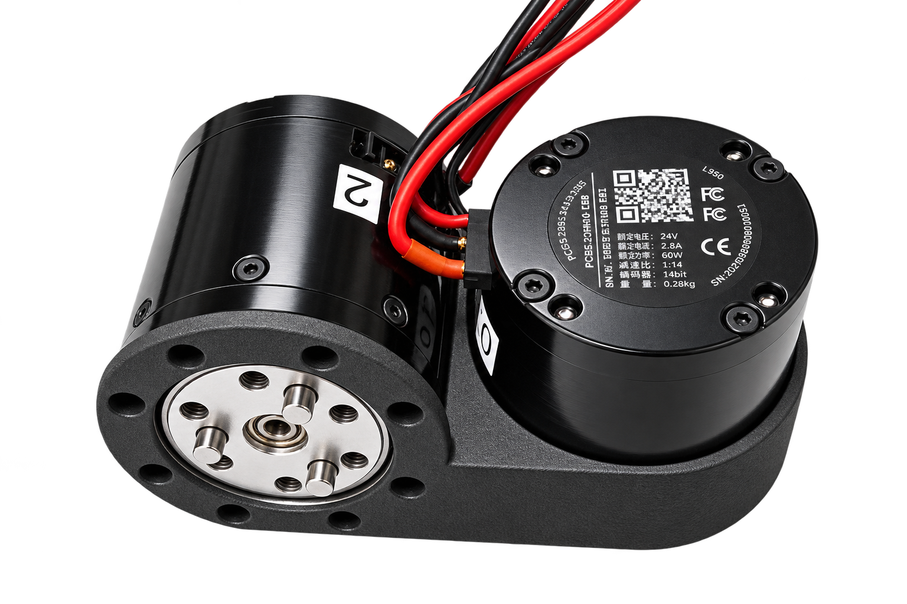

まず、W101のM3x8mmの皿ネジを2つづつ使って、問題なく固定できるか確認する。

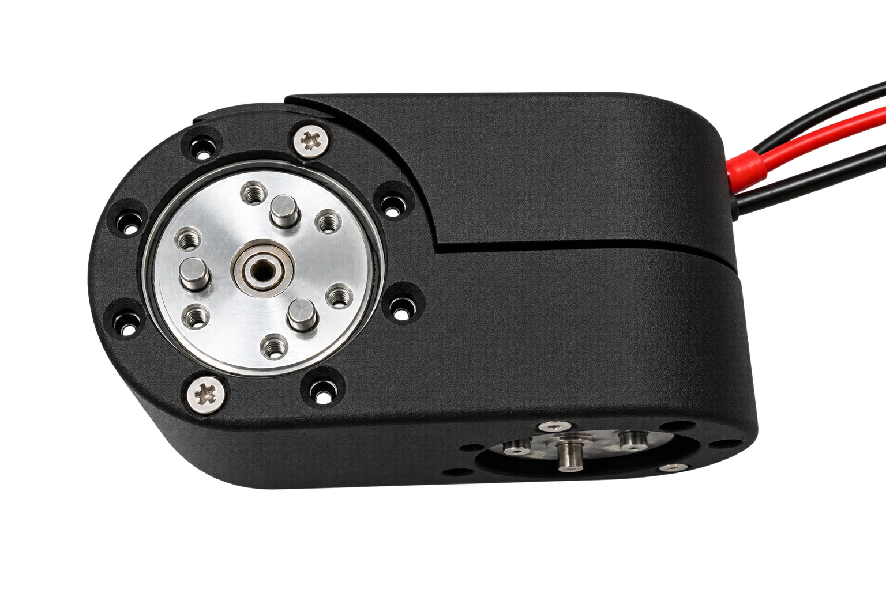

問題なければ、他のねじも止める

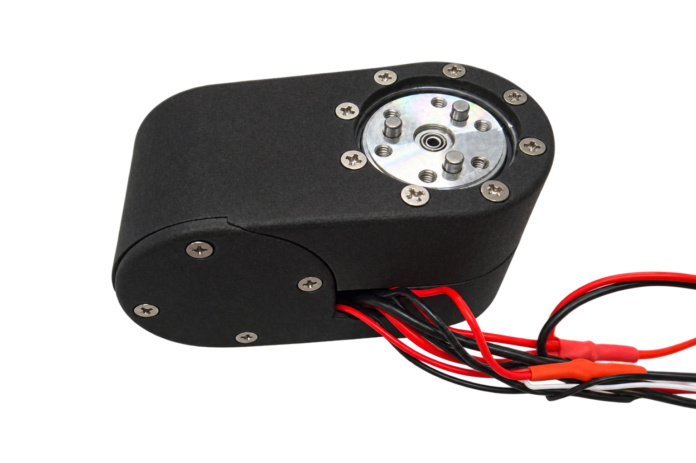

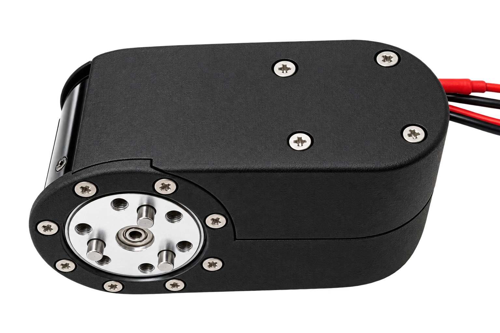

## 3. Handとの結合

一番長いコネクタをハンドに装着する。

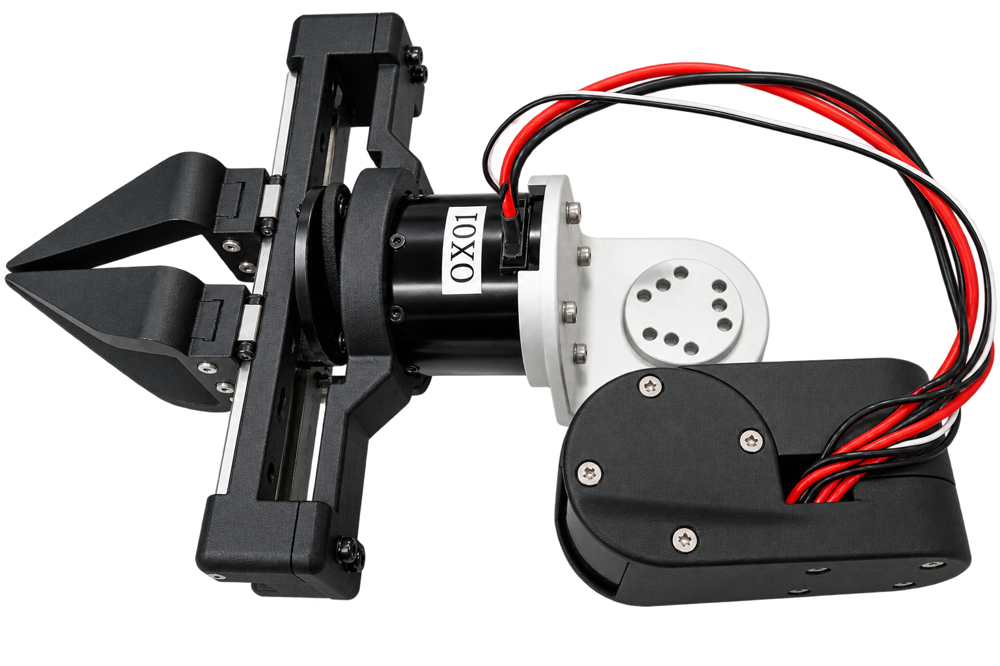

W101のM4x8mmの六角ねじで、ハンドを固定する。

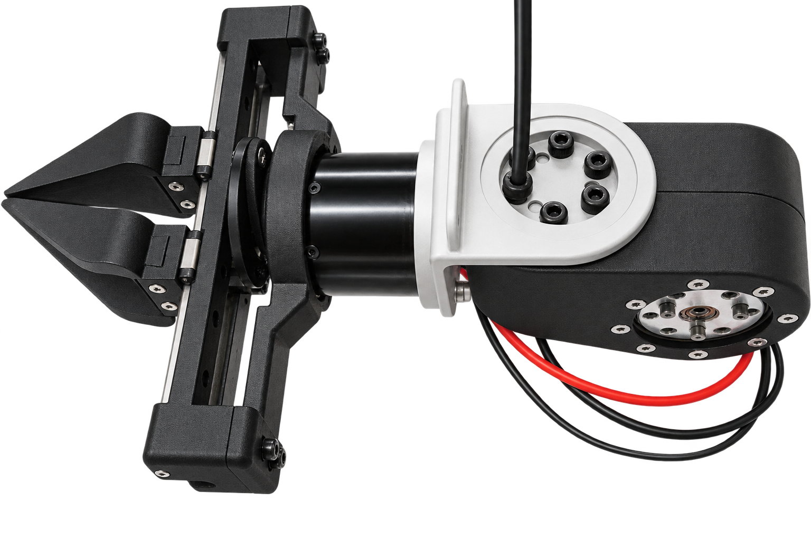

